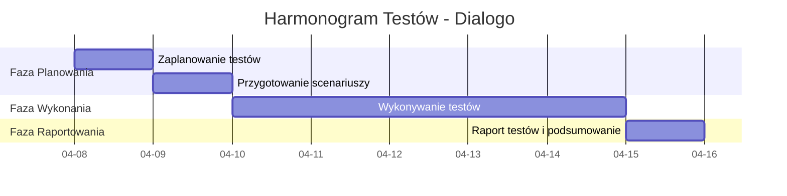

# Test Plan – Dialogo

## 1. Wprowadzenie
Dokument opisuje plan testów dla projektu Dialogo.  
Celem testów jest weryfikacja poprawności działania aplikacji, identyfikacja błędów oraz zapewnienie, że funkcjonalności systemu działają zgodnie z wymaganiami biznesowymi i technicznymi.

Projekt Dialogo jest aplikacją udostępnianą w repozytorium GitHub, będącą komunikatorem z możliwością tworzenia serwerów i kontaktowania się z innymi użytkownikami poprzez komunikację pisemną oraz głosową.

Testy obejmują zarówno weryfikację funkcjonalności interfejsu użytkownika, poprawność działania logiki aplikacji, jak i stabilność infrastruktury.

---

## 2. Cele testów
Główne cele testów:
- Sprawdzenie poprawności działania kluczowych funkcji komunikacji (chat tekstowy, voice/video).
- Weryfikacja poprawności funkcji zarządzania serwerem i uprawnieniami.
- Płynna i bezpieczna obsługa tworzenia oraz zarządzania kontem.
- Weryfikacja aplikacji pod kątem podstawowego bezpieczeństwa danych i autoryzacji.
- Sprawdzenie poprawnego ograniczania działań użytkownika do przypisanej mu roli (RBAC).
- Weryfikacja responsywności i poprawnego działania w docelowych przeglądarkach.
- Zapewnienie bezawaryjnego wyświetlania elementów UI.

---

## 3. Zakres testów

### In Scope
Testowane będą następujące funkcjonalności i obszary:
- Testy backendowe jednostkowe i integracyjne.
- Testy frontendowe E2E automatyzujące kluczowe ścieżki użytkownika (Happy Paths).
- Testy wydajnościowe (dla komunikacji tekstowej i głosowej).
- Testowanie podstawowych luk bezpieczeństwa (np. XSS, SQL Injection, autoryzacja).
- Zarządzanie wiadomościami (wysyłanie, edycja, usuwanie, historia).
- Komunikacja video/audio.
- Zarządzanie kontem, logowanie i rejestracja.
- Zarządzanie serwerem (tworzenie, konfiguracja, role).
- Wyszukiwanie użytkowników i serwerów.
- Dołączanie i opuszczanie serwerów.

### Out of Scope
Poza zakresem testów:
- Testy na natywnych urządzeniach mobilnych (iOS/Android).
- Ekstremalne testy przeciążeniowe bazy danych (poza standardową wydajnością).
- Testy akceptacyjne UAT z klientem końcowym na tym etapie.
- Testy kompatybilności dla przestarzałych przeglądarek (np. Internet Explorer).

---

## 4. Strategia i typy testów
Z uwagi na to, że proces dewelopmentu został zakończony, w projekcie zastosowana zostanie strategia **kompleksowego testowania systemowego**. Skupiamy się na weryfikacji gotowego, w pełni zintegrowanego produktu jako całości. 

Ponieważ zespół testowy ma pełny dostęp do kodu źródłowego aplikacji w repozytorium, weryfikacja będzie w dużej mierze opierać się na technice **testów białoskrzynkowych (white-box testing)**. Pozwoli to na głębszą analizę logiki wewnętrznej systemu, optymalizację pokrycia kodu (code coverage) testami oraz znacznie szybsze i skuteczniejsze diagnozowanie głównych przyczyn powstawania błędów na poziomie struktury aplikacji. Defekty wykryte podczas weryfikacji będą zgłaszane w systemie śledzenia błędów z określonym priorytetem (Low, Medium, High, Blocker).

**Podejście do poszczególnych typów testów:**

- **Testy jednostkowe i integracyjne (Backend & Frontend):** Faza tworzenia kodu jest zakończona, więc ten etap polega na zbiorczym uruchomieniu przygotowanego zestawu testów niskopoziomowych na finalnym kodzie (tzw. testy regresji na poziomie kodu), aby potwierdzić stabilność technicznych fundamentów aplikacji przed przystąpieniem do testów manualnych. Dzięki strategii białoskrzynkowej dokładnie weryfikujemy przepływ danych wewnątrz komponentów.
- **Testy automatyczne E2E:** Skupione na kluczowych ścieżkach krytycznych zintegrowanego systemu (logowanie, wysłanie wiadomości, utworzenie serwera). Uruchamiane na pełnym środowisku QA w celu szybkiego potwierdzenia, że główne procesy biznesowe nie uległy awarii.
- **Testy manualne (Eksploracyjne i Oparte na scenariuszach):** Główne narzędzie weryfikacji działania systemu z perspektywy końcowego użytkownika. Wykonywane w środowisku QA na podstawie przygotowanych scenariuszy testowych (pokrywających wszystkie dostarczone funkcjonalności) oraz w formie testów eksploracyjnych do weryfikacji przypadków brzegowych (Edge Cases) i spójności UI/UX. Stanowią naturalne uzupełnienie weryfikacji strukturalnej o perspektywę "czarnej skrzynki" (od strony interfejsu).
- **Testy wydajnościowe:** Przeprowadzone na gotowym, wyizolowanym środowisku w celu weryfikacji stabilności aplikacji oraz opóźnień (latency) w komunikacji głosowej i tekstowej. Dostęp do kodu (white-box) pozwala tu na precyzyjne monitorowanie zasobów i identyfikację tzw. wąskich gardeł (bottlenecks) bezpośrednio w zapytaniach do bazy danych czy logice serwera.
- **Testy kompatybilności:** Weryfikacja działania kompletnej aplikacji webowej na wiodących silnikach (Chromium, Firefox, WebKit).

---

## 5. Środowiska testowe
Aby zapewnić izolację danych i stabilność, proces testowy będzie realizowany na kilku dedykowanych środowiskach:

### 1. Środowisko Local / DEV
- **Cel:** Wstępna weryfikacja kodu przez programistów, uruchamianie testów jednostkowych.
- **Konfiguracja:** Lokalne maszyny zespołu (Windows 11), bazy danych in-memory lub kontenery Docker.

### 2. Środowisko QA (Testowe)
- **Cel:** Wykonywanie testów automatycznych E2E, testów integracyjnych i manualnych przez zespół QA.
- **Konfiguracja:** Wydzielony serwer z własną bazą danych testowych, połączony z potokiem CI/CD. Stabilne środowisko, na którym odbywa się główna praca testerów.

### 3. Środowisko Staging (Pre-prod / UAT)
- **Cel:** Testy wydajnościowe oraz końcowa weryfikacja biznesowa (akceptacyjna). Środowisko odwzorowujące parametry produkcji (Production-like).
- **Konfiguracja:** Zbliżona infrastrukturalnie do środowiska docelowego. Anonimizowane dane lub wygenerowane duże zbiory danych mockowych dla testów obciążeniowych.

**Wymagania klienckie do testów:**
- System operacyjny: Windows 11
- Przeglądarki: Google Chrome (najnowsza stabilna), Mozilla Firefox (najnowsza stabilna)

---

## 6. Harmonogram testów

## 7. Kryteria wejścia / wyjścia

### Entry Criteria (Mierzalne kryteria rozpoczęcia)
Testy mogą się rozpocząć, gdy:
- Kod projektu jest w pełni zintegrowany, kompletny i dostępny w repozytorium (branch `test` lub `qa`).
- Zakończono pomyślnie budowanie aplikacji (Build Pass) na środowisku testowym (QA).
- Testy jednostkowe przeszły z wynikiem min. **90%**.
- Środowisko QA jest w pełni skonfigurowane, a baza danych zawiera niezbędne dane testowe (seed data).

### Exit Criteria (Mierzalne kryteria zakończenia)
Testy uznaje się za zakończone, gdy:
- **100%** zaplanowanych przypadków testowych (Test Cases) zostało wykonanych.
- Poziom zdawalności (Pass Rate) testów wynosi co najmniej **95%**.
- Pozostało **0** otwartych defektów o priorytecie Blocker, Critical i High.
- Otwarte błędy o priorytecie Medium i Low (maksymalnie 10 zgłoszeń) zostały udokumentowane i zaakceptowane przez zespół jako "Known Issues" na poczet przyszłych poprawek.
- Przygotowano i zatwierdzono końcowy raport z testów (Test Summary Report).

---

## 8. Ryzyka i plan mitygacji

| Ryzyko | Prawdop. | Wpływ | Plan mitygacji (Co robimy, jeśli nastąpi) |
|---|:---:|:---:|---|
| **Brak pełnej dokumentacji projektu** (wymagań) | Wysokie | Średni | Opieramy się na testach eksploracyjnych. Organizujemy szybkie spotkania synchronizacyjne z deweloperami (tzw. "3 Amigos") i dokumentujemy ustalenia na bieżąco. |
| **Niestabilność środowiska testowego (QA)** | Średnie | Wysoki | Zgłaszamy problem do DevOps / zespołu infrastruktury. Jako backup, testujemy manualnie na lokalnych środowiskach (DEV) do czasu przywrócenia QA. |
| **Błędy specyficzne dla przeglądarki** (różnice Chrome/Firefox) | Średnie | Średni | Jeśli wystąpią, priorytetyzujemy naprawę błędów na przeglądarce o największym udziale rynkowym (Chrome). Różnice w Firefox dokumentujemy i ustalamy z biznesem czas ich naprawy. |
| **Brak zaawansowanej wiedzy o narzędziach testerskich u części zespołu** | Niskie | Średni | Wdrażamy Pair Testing (testowanie w parach - QA bardziej doświadczony z mniej doświadczonym). Korzystamy z intuicyjnych narzędzi dopasowanych do obecnych umiejętności zespołu. |
| **Wykrycie dużej liczby krytycznych błędów blokujących (Blocker)** | Średnie | Wysoki | Zgłaszamy błędy z najwyższym priorytetem do natychmiastowej naprawy przez deweloperów. W międzyczasie zespół QA przełącza się na testowanie modułów aplikacji, które nie są zablokowane. |

---

## 9. Role i odpowiedzialności

| Osoba | Odpowiedzialność |
|-----|-----|
| **QA Lead** (Urszula Konopko) | Przygotowanie planu testów, konfiguracja narzędzi, wykonanie testów automatycznych, finalny raport. |
| **QA Engineer** (Eryk Śliwowski) | Testy wydajnościowe oraz testy manualne na podstawie rozpisanych scenariuszy testowych. |
| **QA Engineer** (Mateusz Izdebski) | Testy integracyjne oraz testy manualne na podstawie rozpisanych scenariuszy testowych. |
| **QA Engineer** (Krzysztof Sobolewski) | Testy jednostkowe oraz testy manualne na podstawie rozpisanych scenariuszy testowych. |
